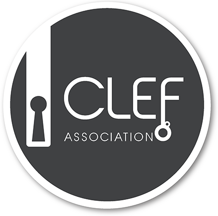

# Vision

In this workshop lab, we would like to bring together IR researchers interested in the online evaluation of academic search systems. The goal is to foster knowledge on improving the search for academic resources like literature (ranging from short bibliographic records to full-text papers), research data, and the interlinking between these resources. The employed online evaluation approach in this workshop allows the direct connection to existing academic search systems from the Life Sciences and the Social Sciences.

The motivation behind this lab is to 
- bring together interested researchers
- advertise the online evaluation campaign idea, and
- develop ideas, best practices, and guidelines for a full online evaluation campaign at CLEF 2021.

# Background

We see academic search as a broader term for scientific and especially domain-specific retrieval tasks which comprises Document as well as Dataset Retrieval.
As huge platforms like Google Scholar (or Google Dataset Search) are not open to public research and do not offer any domain-specific features, we focus on mid-size scientific search systems that offer domain-specific resources and use cases. This focus allows for using many specific information types like bibliographic metadata, usage data, download rates, citations, etc., in order to develop and evaluate innovative search applications. Further details on current evaluation infrastructures in academic search can be found in [Schaible et al. (2020)](http://link.springer.com/article/10.1007/s13222-020-00335-x).

We would like to move beyond the traditional offline evaluation setup and bring together evaluation techniques from industry and practice into the academic realm. Therefore, utilizing online evaluations, as taking the actual user into account, would be a step forward towards improving the evaluation situation.
The details of the online experiments and the metrics are to be discussed at the workshop, but right now we favor a setup which is based on a Docker container infrastructure that is briefly described in [Breuer et al. (2019)](http://ceur-ws.org/Vol-2409/position01.pdf) and would incorporate usage feedback like click-through rates.

# Call for Contribution

For our workshop lab, we encourage participants both from academia and industry to submit their work on the theory, experimentation and practice regarding academic search systems and/or living lab evaluations. We strongly support novel ideas on either improving academic search, or on advancing the use of living labs to evaluate retrieval approaches. Furthermore, we support submissions on lessons learned on both academic search and living labs, to ignite discussions on how it is possible to improve their use. Our call for submission comprises, but is not limited to, the following: 
- design and evaluation of intelligent search and recommendation approaches
- design and evaluation of novel user interfaces aiding users to find scholarly resources
- discussion of offline and online evaluation metrics and methods for measuring a system’s ability to aid users in finding scholarly resources 
- discussion on alleviating the reproducibility issue of evaluation results

  
We solicit two types of contributions:

__Research and Lessons Learned papers__ presenting novel contributions in the area of academic search and/or living lab systems as well as lessons learned discussing current challenges and possible solution mitigating the problems. Papers should be up to 8 pages including references.

__Open ideas, discussion, and demo papers__ describing ideas that are not yet in the scope of a research contribution but illustrate an aspect of academic search and living lab systems that should be taken into account in the future. Papers should be up to 4 pages including references.

# Submission Guidelines

Submissions must be as PDF, formatted in the style of the Springer Publications format for Lecture Notes in Computer Science (LNCS). For details on the LNCS style, see [Springer’s Author Instructions](https://www.springer.com/gp/computer-science/lncs/conference-proceedings-guidelines). Authors should use Springer’s proceedings templates, either for LaTeX or for Word, and are encouraged to include their ORCIDs in the papers. 

All submissions must be written in English and should be submitted electronically through the [conference submission system](https://www.easychair.org/conferences/?conf=clef2020).

# Tasks

As this is a workshop lab, we don't have any explicit tasks like regular evaluation labs at CLEF. 

Nevertheless we would like to release some sample data sets from the scientific search systems LIVIVO and GESIS-wide Search and some Docker templates to allow early adopters to implement first prototypes for an online evaluation. At the workshop we would like to have these early adopters who took part in this open beta phase to present their first-hand experiences to lay a foundation for 2021.

# Dates and Schedule
__Please register with CLEF 2020 until Sunday, 26 April 2020 at http://clef2020-labs-registration.dei.unipd.it/index.php__ 

* 26 April 2020: Registration for the Lab (contact us, if this is an issue to you)
* 24 May 2020: Submission of Participant Papers
* 14 June 2020: Notification of Acceptance Participant Papers
* 28 June 2020: Camera Ready Copy of Participant Papers 
* 17-22 July 2020: CEUR-WS Working Notes Preview for Checking by Authors

For further details, please refer to the [CLEF 2020 schedule](https://clef2020.clef-initiative.eu/index.php?page=Pages/schedule.html)

# Organization

We plan to have a *half-day workshop* that is split up in two parts. 

The first part will consist of an *overview presentation* by the organizers, *invited talks* (e.g. from the organizers of the former CLEF labs LL4IR or NewsREEL to present lessons learned from previous campaigns) and some *lightning talks* from early adopters who implemented first prototypes based on the data and APIs made available or that describe an interesting use case or idea that could lead into a task in 2021. We invite participants of the workshop to submit short technical or position papers that would lead into the lightning talks.

The second half will consist of *break-out sessions* which should be inspired by the talks of the first half and might focus on topics like data sets, technical setups, evaluation metrics, interfaces or task design. The break-out groups will organize themselves using collaborative text editors like Google Docs to allow a later documentation of the discussion and idea tracking.

The workshop will end with some short presentations of the results of the break-out sessions.

## LiLAS 2020 Chairs

- [Philipp Schaer](https://ir.web.th-koeln.de/people/philipp-schaer/), TH Köln, Germany
- [Johann Schaible](https://gesis.org/person/johann.schaible), GESIS, Germany
- Leyla Jael Garcia-Castro, ZB MED, Germany

## Program Committee 

- Krisztian Balog, University of Stavanger, Norway
- Joeran Beel, Trinity College Dublin, Ireland
- Birger Larsen, Aalborg University, Denmark
- Philipp Mayr, GESIS, Germany
- Tommaso di Noia, Politecnico di Bari, Italy
<!-- Needs to confirm - Ansgar Scherp, University of Essex, UK -->

---

Contact: <lilas@stella-project.org>

LiLAS ist part of CLEF 2020 held in Thessaloniki.

